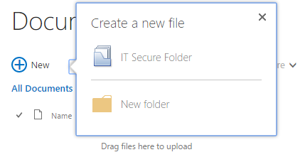
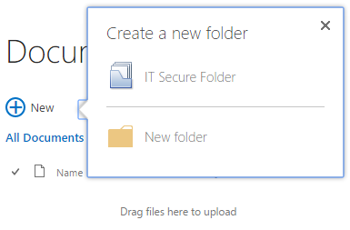

# Header Text in New Button Callout
#### Description
#### Before

#### After

#### Snippet
```css
h2[id^="cojs-newdocWOPI"].js-callout-title {
	visibility: hidden;
}

h2[id^="cojs-newdocWOPI"].js-callout-title:after {
	content: "Create a new folder";
	visibility: visible;
	position: absolute;
    left: 0;
    margin-left: 20px;
}
```
#### Applies To
SharePoint Online